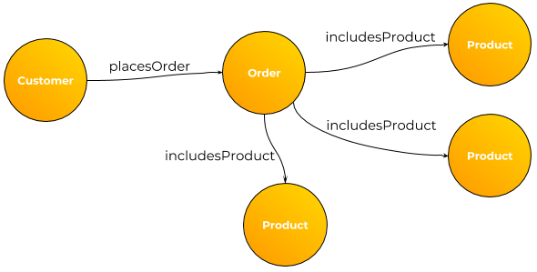

# Qué son las bases de datos orientadas a grafos y para qué se usan
No importa si estas empezando a programar o sos un ingeniero experimentado, en cada proyecto te toca responder la pregunta: ¿Qué tecnología debería usar? ¿Qué soporta mejor lo que quiero hacer? En un mundo donde cada vez hay más opciones, esta pregunta no es tan fácil de responder. Pero te aseguro una cosa:

> "La calidad del proyecto depende de los conocimientos y las tecnologías que el diseñador del mismo maneje" - Ariel Mirra

Haciendo este análisis en mi tesis de grado conocí y usé las **bases de datos orientadas a grafos** (o BDOG de acá en adelante), particularmente [Neo4j]() y hoy vengo a transmitirte este conocimiento para expandir tus horizontes de software y herramientas.

## ¿Qué es un grafo?
Para los que no conocen este poderoso concepto, un grafo es simplemente una forma de guardar información en **entidades y relaciones**, generalmente representado como **nodos y vértices**.

A diferencia de las bases de datos relacionales (todo lo que use SQL), estas bases de datos representan entidades sin conceptos como *keys* (PK/FK), cardinalidad, herencia y otros. Las bases de datos orientadas a grafos son más simples a la hora de guardar la información. ¿Esto es bueno? ¿Es malo? Depende únicamente de lo que querés hacer.

### Quiero verlo gráficamente
Nada mejor para explicar este tipo de base de datos que con un gráfico:


Figura 1: Base de datos de clientes, órdenes y productos en una base de datos relacional




Figura 2: Base de datos de clientes, órdenes y productos en una base de datos orientada a grafos


### Perfecto, ¿Cuándo conviene usarla?
En un grafo, agregar y quitar relaciones interdependientes y complejas entre entidades es sumamente fácil y más entendible. En cambio, en una base de datos basada en tablas la complejidad de agregar relaciones crece de forma exponencial a la complejidad del modelo. Con grafos, los cambios en el esquema de las entidades tienen un costo mucho mas bajo a SQL. Además, si lo que se quiere persistir es la relación entre entidades no cabe duda que un grafo es la mejor opción. 

Gracias a estas ventajas, las bases de datos orientadas a grafos son particularmente útiles en sistemas cuyos casos de uso requieren:

- Representación de redes de información
- Información dinámica y cambiante
- No hay un esquema fijo
- Pueden haber distinto número de atributos 

Como por ejemplo:

- Redes sociales
- Knowledge Graphs para Inteligencia Artificial
- Sistemas de recomendaciones a usuarios
- Redes Neuronales de Machine Learning
- Árboles jerárquicos


## Manos a la obra
Suficiente teoría por hoy. Se aprende mucho más cuando los dedos empujan teclas.

Para empezar descargaremos una excelente BDOG llamada [Neo4j](https://neo4j.com/download). También podemos jugar con el [sandbox](https://neo4j.com/sandbox) que nos ofrece para empezar ya mismo, es gratis y nos podemos registrar con Google.

En lo que sigue del tutorial usaremos el sandbox así cualquiera puede seguir el tutorial. Lo que haremos será:

1. Crearnos una cuenta y un proyecto en la plataforma
2. Abrir el proyecto en el navegador
3. Correr nuestra primer línea de Cypher Query Language
4. Admirar la belleza de los nodos interconectados mediante relaciones y la excelente interfaz gráfica de Neo4j
5. ¡Y lo vamos a hacer todo esto en menos de 5 minutos!

### Setup del proyecto

Lo primero es ingresar a la plataforma y elegir un proyecto base para jugar. En mi caso elegí Twitter. Neo4j nos creó un container con nuestra BDOG en la que podemos jugar e incluso conectar con alguna aplicación nuestra. Ahora esperamos y abrimos el proyecto en el navegador.


Lo primero que veremos será algo así, y acá mismo podemos quedarnos a experimentar un buen rato, pero como dije menos de 5 minutos vamos a simplemente correr la query:

``` bash
MATCH (n) RETURN n LIMIT 25
```

Que me mostrará 25 nodos y sus relaciones. Inmediatamente podemos ver cómo Neo4j grafica los nodos y sus relaciones y que podemos interactuar con ellos. En el menú de la izquierda podemos hacer selecciones y filtrar sin necesidad de correr comandos en [Cypher Query Language](https://neo4j.com/developer/cypher-query-language) nosotros mismos.

### Cypher Query Language
Similar al SQL, a un grafo podemos recorrerlo y darle órdenes (queries) mediante un lenguaje llamado Cypher Query Language. Este lenguaje es bastante intuitivo para empezar, sobre todo si tenemos conocimientos previos de SQL. Acá les dejo una [lista de recursos disponibles](https://neo4j.com/developer/cypher-resources) de Cypher incluyendo eBooks, videos y tutoriales por si quieren profundizar más sobre el tema (es super interesante).

Volviendo a nuestra BDOG en el navegador, sea cual sea el comando que corrieron para analizar el grafo, lo interesante es que podemos ver la misma información plasmada en el grafo en formatos como tabla y JSON, lo que nos da una idea lo fácil y compatible que este tipo de bases de datos son con el resto del ecosistema:


### Ya has visto suficiente
Esto es todo lo que tenes que saber sobre BDOG para empezar, los puntos interesantes a tener en cuenta son:

- Los casos de uso para usar una BDOG son definidos y particulares, hay que saber cuando usarlas y obtener todos sus beneficios
- Utiliza un lenguaje especial para recorrer el grafo
- Neo4j es el proveedor más conocido y posee recursos y una interfaz de calidad (y no, no me están pagando por decir esto lamentablemente).


## Ahora te toca a ti
Espero que te haya servido para aprender algo nuevo, ahora te toca seguir aprendiendo y profundizando. Gracias por estar acá.

Un saludo, [Ariel Mirra](https://linktr.ee/arielmirra).

[instagam](https://www.instagram.com/ariel.mirra) | [linkedin](linkedin.com/in/ariel-mirra) | [otros proyectos](https://linktr.ee/arielmirra)